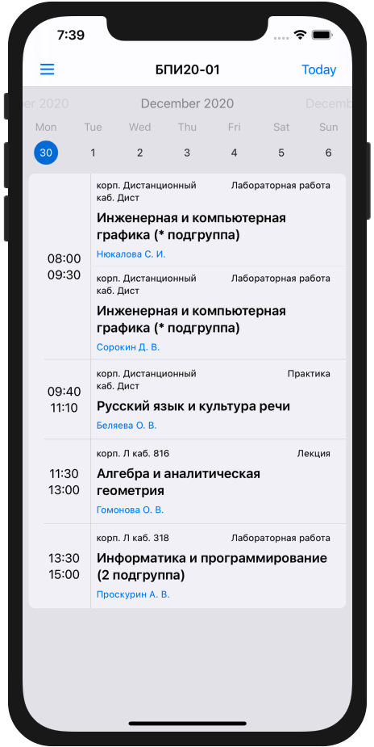

SibGU Timetable
=====

It's the best way to view SibGU's timetable on your iPhone device!

## Features
- Offline timetable
- Dark Theme
- Currently featuring 2 languages (`Russian` and `English`)
- Written using only `native` tools: `Swift 5` and `UIKit`
- Onboarding screen for first app opening

## Development
- All `UIKit` views created in code
- App is based on `MVVM` and `Coordinator` design patterns
- Network requests are performed by `URLSession`
- `RxSwift` is used for data binding between the view model and view
- `CoreData` persist loaded timetable from server
- For logging is used `swift-log`

## Screens

